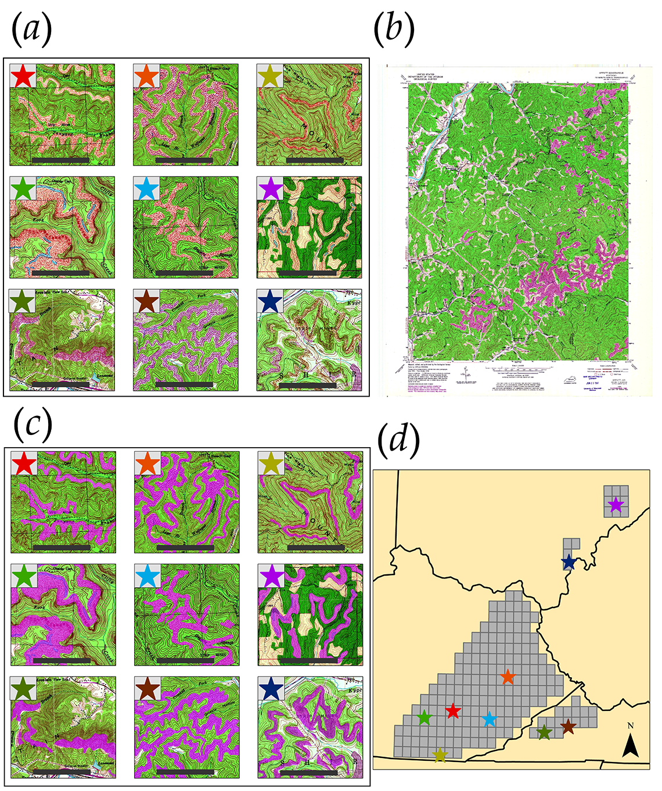

# topoDL
Semantic segmentation applied to historic topogrpahic maps
# UNet Semantic Segmentation for Extracting Historic Surface Mining Disturbance from Topographic Maps

---

## Description

Maxwell, A.E., M.S. Bester, L.A. Guillen, C.A. Ramezan, D.J. Carpinello*, Y. Fan, F.M. Hartley, S.M. Maynard, and J.L. Pyron, 2020. Semantic segmentation deep learning for extracting surface mine extents from historic topographic maps, *Remote Sensing*, 12(24): 1-25. https://doi.org/10.3390/rs12244145. 

This project explores the use of UNet semantic segmentation deep learning for extracting historic surface disturbance associated with coal mining from topographic maps. The associated paper can be found [here](https://www.mdpi.com/2072-4292/12/24/4145). As part of the repo, we have provided the required input data. We did not provide the image chips and masks generated from the data since the dataset was very large (~70GB). However, you can generate the chips and masks using the provided input data and scripts.  

The goal of our study was to assess model generalization and the impact of training sample size on model performance and generalization. We have generated this repo to provide access to our scripts and data so taht others can experiment with our method or use the data in other studies.

Here is the abstract for the associated paper:

Historic topographic maps, which are georeferenced and made publicly available by the United States Geological Survey (USGS) and the National Map’s Historical Topographic Map Collection (HTMC), are a valuable source of historic land cover and land use (LCLU) information that could be used to expand the historic record when combined with data from moderate spatial resolution Earth observation missions. This is especially true for landscape disturbances that have a long and complex historic record, such as surface coal mining in the Appalachian region of the eastern United States. In this study, we investigate this specific mapping problem using modified UNet semantic segmentation deep learning (DL) and a large example dataset of historic surface mine disturbance extents from the USGS Geology, Geophysics, and Geochemistry Science Center (GGGSC). The primary objectives of this study are to (1) evaluate model generalization to new geographic extents and topographic maps and (2) to assess the impact of training sample size, or the number of manually interpreted topographic maps, on model performance. Using data from the state of Kentucky, our findings suggest that DL semantic segmentation can detect surface mine disturbance features from topographic maps with a high level of accuracy (Dice coefficient = 0.902) and relatively balanced omission and commission error rates (Precision = 0.891, Recall = 0.917). When the model is applied to new topographic maps in Ohio and Virginia to assess generalization, model performance decreases; however, performance is still strong (Ohio Dice coefficient = 0.837 and Virginia Dice Coefficient = 0.763). Further, when reducing the number of topographic maps used to derive training image chips from 84 to 15, model performance was only slightly reduced, suggesting that models that generalize well to new data and geographic extents may not require a large training set. We suggest the incorporation of DL semantic segmentation methods into applied workflows to decrease manual digitizing labor requirements and call for additional research associated with applying semantic segmentation methods to alternative cartographic representations to supplement research focused on multispectral image analysis and classification.  

**Project Lead**

Aaron Maxwell, Assistant Professor, WVU Department of [Geology and Geography](https://www.geo.wvu.edu/)

Website: [WV View](http://www.wvview.org/)

**Project Collaborators** 
- WVU Geology and Geography: Michelle Bester (PhD student, Geography), Luis A. Guillen (PhD student, Forestry/GRA in Maxwell Lab), Jesse Carpinello (MS student, Geology), Yiting Fan (PhD student, Geography), Faith Hartley (MA student, Geography), Shannon Maynard (MS student, Geology), and Jaimee Pyron (MA student, Geography)
- WVU John Chambers College of Business and Econonmics: Dr. Chris Ramezan, PhD (Assistant Professor)

**Aknowledgements**
- The United States Geological Survey provides public access to historic, scanned, and georeferenced topographic maps via the National Map’s Historical Topographic Map Collection. 
- The USGS Geology, Geophysics, and Geochemistry Science Center (GGGSC) created the example data used in this study.
- This research was partially funded by the National Geographic Society, Leonardo DiCaprio Foundation, and Microsoft via an AI for Earth Innovation grant, which provided access to computational resources via Microsoft Azure.

#### Technologies

- [UNet](https://keras.rstudio.com/articles/examples/unet.html)
- [Keras](https://keras.rstudio.com/index.html)
- [R](https://cran.r-project.org/)
- [ArcGIS Pro/Export Training Data for Deep Learning](https://pro.arcgis.com/en/pro-app/tool-reference/image-analyst/export-training-data-for-deep-learning.htm)

#### R Packages

- [keras](https://cran.r-project.org/web/packages/keras/index.html)
- [tidyverse](https://cran.r-project.org/web/packages/tidyverse/index.html)
- [dplyr](https://cran.r-project.org/web/packages/dplyr/index.html)
- [ggplot2](https://cran.r-project.org/web/packages/ggplot2/index.html)
- [cowplot](https://cran.r-project.org/web/packages/cowplot/index.html)

---

## How To Use

#### Set Up Notes

- We conducted our experiments on a Windows 10 machine using a GPU. This required setting up the NVIDIA CUDA Toolkit and cuDNN. [This](https://towardsdatascience.com/python-environment-setup-for-deep-learning-on-windows-10-c373786e36d1) is a good tutorial for setting up a DL environment in Windows.
- R actually uses Python to implement Keras. So, you will need to set up a Python DL environment. We used [Anaconda](https://www.anaconda.com/).
- You will need to link to your conda environment in R using [reticulate](https://cran.r-project.org/web/packages/reticulate/index.html).

#### Method Overivew

1. Mining and prospect features form the [GGGSC](https://www.sciencebase.gov/catalog/item/5a1492c3e4b09fc93dcfd574) were manually evaluated to generate the training polygon vector data.
2. Imge chips were derived using the Export Training Data for Deep Learning Tool in ArcGIS Pro. All chips that included any mine features were included. A subset of background-only chips, 150 per quad, were also included (see chip_prep.ipynb and chip_prep_background.ipynb scripts).
3. UNet was implemented with Keras within R (see the model_prediction_evaluation.R script).
4. Additinal experimentation was performed to assess the impact of training sample size, or the number of manullay digitized topogrpahic maps (see sample_size_experiments.R script).

#### Implementation Specifics

- This project used a modified version of UNet. Specifically, we used a leaky ReLU activation function for the convolutional layers. We also optimized using Adamax and the Dice loss metric. 
- Image processing in R was conducted using keras and [magick](https://cran.r-project.org/web/packages/magick/index.html).
- An image chip size of 128-by-128 pixels was used. The image masks are binary (1 = mining, 0 = background). Images and masks are in PNG format with spatial reference information.

#### Script/Code Files

- **model_prediction_evalaution.R**: main file for image and dataset pre-processing, UNet model compiling, model training, and model evaluation. We also include code to predict back to entire topographic maps. Training the model required roughly 24 hours on our single GPU machine. Predicting to a single topographic map took roughly 15 minutes. 
- **chip_prep.ipynb**: code for creating image chips (just chips with mining present). This makes use of the Export Training Data for Deep Learning Tool in ArcGIS Pro. 
- **chip_prep_background**: code for creating image chips (all chips). This makes use of the Export Training Data for Deep Learning Tool in ArcGIS Pro. 
- **sample_size_experiments.R**: code used to compare models that used subsets of the training chips.
- **loss_graphs.R**: code to generate loss graphs with ggplot2.
- **sample_size_loss_graphs.R**: code to generate loss graphs with ggplot2 to compare models using different sample sizes. 
- **sample_size_metrics.R**: create metrics and plots to compare models using different sample sizes. 
- **boxplots**: code to generate boxplots using ggplot2.
- **remove_ponds.R**: code to remove ponds from the example data. 
- **tables.zip**: tables used to generate graphs. 

#### Data Files
- **tables.zip**: tables used to generate graphs. 
- **topo_dl_data.zip**: input topographic maps, mine extents, and quad boundaries used in the study. The chip prep script scan be used to created chips and masks from these data. This compressed folder contains the following subfolders (ky_mines, ky_quads, ky_topos, oh_mines, oh_quads, oh_topos, va_mines, va_quads, va_topos). The mines folders contain the mine extents for each topographic map used in the study while the quads folders contain the quadrangle boundaries. All vectore data are in shapefile format. The topos folders contain the topographic maps in TIFF format.
- **final_model.hdf5**: final trained UNet model used in the study. 
